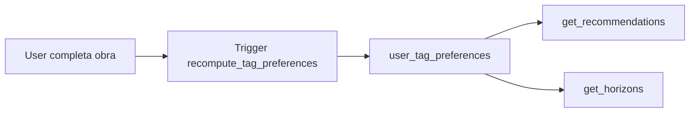

<div align="center">

  <br />
  <h1>🔭 H U B B L E</h1>
  <p><strong>Ecossistema Unificado & Privado de Rastreamento de Mídia</strong></p>

  <p>
    Centralize o registro de progresso, notas e percepções pessoais de todo tipo de mídia ocidental e oriental em uma única plataforma minimalista e sem distrações sociais.
  </p>

  <p>
    <a href="#-visão-geral">Visão Geral</a> •
    <a href="#-funcionalidades-chave">Funcionalidades</a> •
    <a href="#-stack-tecnológica">Stack</a> •
    <a href="#-arquitetura-e-dados">Arquitetura</a> •
    <a href="#-roadmap-do-projeto">Roadmap</a> •
    <a href="#-como-executar">Como Executar</a> •
    <a href="#-troubleshooting-erros-comuns">Troubleshooting</a>
  </p>

  <p>
    
    
    
    
    
    
    
  </p>

  <br />
</div>

---

## 💡 Visão Geral & Filosofia

O **Hubble** nasceu para combater a **fadiga da fragmentação de mídia**. Atualmente, quem consome conteúdo audiovisual e leitura precisa alternar entre múltiplas plataformas (Letterboxd para filmes, TV Time para séries, AniList para animes, MyAnimeList para mangás).

O Hubble resolve isso oferecendo uma **centralização privada de alto desempenho**:

* 🔒 **Privacidade por Padrão:** Sem feeds públicos, seguidores ou métricas de vaidade. Seu diário de mídia é 100% seu.
* 🦎 **Interface Camaleão:** O design se molda dinamicamente ao tipo de mídia (Modo Cinema Imersivo para vídeo vs. Modo Lista/Planilha Ultra-Rápida para leitura).
* ⚡ **Performance Sem Bloqueios:** Mapeamento local de dados usando o *Anime Offline Database* para evitar travamentos de API e *Rate Limits*.

---

## ✨ Funcionalidades Chave

### 🎨 Engenharia de Interface Camaleão

* 🎬 **Modo Streaming (Vídeo):** Tema escuro imersivo estilo sala de cinema, com grandes *backdrops*, trailers, e carroséis horizontais.
  * **Classificação Etária BR:** Exibição nativa dos selos de classificação etária brasileira (`L`, `10`, `12`, `14`, `16`, `18`) e descritores em hover.
  * **Distintivo de Prestígio:** Faixas douradas e troféus (🏆) para obras vencedoras de premiações históricas do cinema e da animação.
* 📊 **Modo Lista Premium (Leitura):** Tabela ultra-compacta focada em produtividade para leitores assíduos de Mangás, Manhwas e Manhuas.
  * **Incremento com 1 Clique (`+1 Capítulo`):** Atualização otimista na UI sem recarregar a página.

### 🧠 Inteligência & Personalização

* 📝 **Meus Insights Privados:** Diário de bordo em texto rico/markdown para cada obra, onde você registra teorias, citações e percepções pessoais sem expor para a internet.
* 🎯 **Algoritmo Silencioso de Gosto:** Matriz invisível de afinidade por tags (`-50` a `+100`). Avaliar bem uma obra soma pontos para suas tags; avaliar mal subtrai.
* 🌌 **Aba "Novos Horizontes":** Sistema anti-bolha que sugere obras altamente aclamadas de gêneros que você ainda não explorou.
* ⚙️ **Filtro Adulto (NSFW) & Desativação Modulares:** Se você não consome filmes e séries, desative a opção nas configurações e a interface ocultará todos os menus de vídeo, tornando o Hubble 100% focado em quadrinhos.

---

## 🛠️ Stack Tecnológica

O Hubble foi projetado para rodar de forma **100% gratuita** utilizando serviços serverless de alta performance e código aberto:

* **Front-End:** [Next.js](https://nextjs.org/) (App Router, Server Components) + [Tailwind CSS](https://tailwindcss.com/) + [Framer Motion](https://www.framer.com/motion/)
* **Banco de Dados:** [PostgreSQL](https://www.postgresql.org/) hospedado no [Supabase](https://supabase.com/) ou [Neon](https://neon.tech/)
* **Back-End / API:** Next.js Route Handlers + Supabase Edge Functions
* **Ingestão de Dados Semanal:** [GitHub Actions](https://github.com/features/actions) (Cron Workflow baixando o *Anime Offline Database* via stream)
* **Hospedagem:** [Vercel](https://vercel.com/) (Camada Gratuita)
* **Tipagem:** TypeScript estrito com tipos gerados do banco (`src/lib/database.types.ts`)

---

## 🏗️ Arquitetura & Fluxo de Ingestão de Dados

Para evitar o colapso por *Rate Limit* (Erro 429) e manter buscas em milissegundos sem estourar quotas de servidores gratuitos, o Hubble adota uma arquitetura de mapeamento offline de IDs:

```text
┌──────────────────────────────────────────────────────────┐
│              GitHub Actions (Cron Semanal)               │
│ Downloads: Anime Offline Database (JSON ~80MB)           │
└────────────────────────────┬─────────────────────────────┘
                             │ Batch Insert / UPSERT
                             ▼
┌──────────────────────────────────────────────────────────┐
│          PostgreSQL / Supabase (Tabela Local)            │
│  [anilist_id | mal_id | kitsu_id | tmdb_id | mangadex]   │
└────────────────────────────┬─────────────────────────────┘
                             │ Consulta Interna
                             ▼
┌──────────────────────────────────────────────────────────┐
│            Hubble Web App (Next.js UI)                   │
│ Renderiza Busca Unificada e Atualizações sem Bloqueios   │
└──────────────────────────────────────────────────────────┘
```

### Estrutura do Banco (9 Tabelas)

| Tabela | Descrição |
|--------|-----------|
| `profiles` | Perfil do usuário (estende `auth.users`) |
| `media_catalog` | Catálogo unificado de obras (anime, manga, movie, tv, novel, game) |
| `user_media_progress` | Progresso do usuário por obra (episódios/capítulos, score, status) |
| `user_tag_preferences` | Matriz de afinidade por tags (gênero, tema, estúdio) |
| `media_titles_i18n` | Títulos alternativos multi-idioma |
| `awards` | Premiações vinculadas às obras (admin) |
| `export_logs` | Auditoria de exportações de dados do usuário |
| `ingestion_logs` | Logs dos jobs de ingestão semanal |
| `offline_anime_mapping` | Mapeamento cruzado AODB → AniList/MAL/Kitsu/ANIDB |

### RPCs Disponíveis

| Função | Descrição |
|--------|-----------|
| `get_recommendations(user_id, limit)` | Recomendações baseadas em afinidade de gêneros |
| `get_horizons(user_id, limit)` | **Novos Horizontes** - anti-bolha: obras bem avaliadas de gêneros inexplorados |
| `get_user_stats(user_id)` | Estatísticas pessoais (totais, médias, top gêneros/estúdios) |

### Triggers Ativos

| Trigger | Tabela | Ação |
|---------|--------|------|
| `set_updated_at_*` | profiles, media_catalog, user_media_progress | Atualiza `updated_at` automaticamente |
| `recompute_tag_preferences` | user_media_progress | Atualiza `user_tag_preferences` ao completar obra com score ≥ 8.0 |
| `block_hiatus_progress` | user_media_progress | Bloqueia incremento de progresso em mídia com `release_status = 'hiatus'` |
| `on_auth_user_created` | auth.users | Cria `profile` automaticamente no signup |

---

## 🧠 Algoritmo de Recomendação (Detalhado)

### Visão Geral

O Hubble utiliza um **sistema híbrido em evolução** baseado em **Content-Based Filtering via Tag Affinity** como fundação, projetado para evoluir progressivamente para abordagens híbridas colaborativas conforme a base de usuários cresce — **sem nunca sacrificar privacidade, cold-start zero ou explicabilidade**.

### Estado Atual (v0.1 — Production Ready)

#### Arquitetura Implementada


#### Tabela: `user_tag_preferences` (Matriz de Afinidade)
| Coluna | Tipo | Descrição |
|--------|------|-----------|
| `user_id` | UUID | FK → profiles |
| `tag_type` | TEXT | `'genre' \| 'theme' \| 'studio'` |
| `tag_name` | TEXT | Nome da tag (ex: "Sci-Fi", "Cyberpunk", "Studio Ghibli") |
| `score` | INT | `-50` a `+100` (inicial 0) |
| `updated_at` | TIMESTAMPTZ | Para decay temporal futuro |

#### Sinais Explícitos (Hoje)
| Ação | Trigger | Delta por Tag |
|------|---------|---------------|
| Completar com **score ≥ 8.0** | `recompute_tag_preferences` | `genre: +10`, `theme: +5`, `studio: +3` |
| Completar com **score ≤ 5.0** | `recompute_tag_preferences` | `genre: -5`, `theme: -3`, `studio: -2` |
| Drop early / abandonado | (planejado Phase B) | Penalidade progressiva |

#### RPCs Disponíveis
| Função | Lógica | Uso |
|--------|--------|-----|
| `get_recommendations(user_id, limit)` | Obras `score > 7.5` que compartilham gêneros com `score > 0` no perfil | Aba "Para Você" |
| `get_horizons(user_id, limit)` | **Anti-bolha**: obras `score > 8.0` de gêneros com `score = 0` ou `NULL` | Aba "Novos Horizontes" |
| `get_user_stats(user_id)` | Retorna `top_genres[]`, `top_studios[]` ordenados por score | Dashboard de Gosto |

#### Métricas Atuais
| Métrica | Valor | Status |
|---------|-------|--------|
| **Cold Start** | 1 avaliação ≥ 8.0 | ✅ Zero cold-start |
| **Latência RPC** | <15ms (p95) | ✅ Excelente |
| **Explicabilidade** | "Porque você gosta de Sci-Fi + Cyberpunk" | ✅ Nativa |
| **Privacidade** | Zero dados externos, só suas avaliações | ✅ Total |
| **Cobertura** | Limitada a gêneros explícitos | ⚠️ Gap conhecido |

---

### Limitações Conhecidas (v0.1)

| Limitação | Impacto | Mitigação Planejada |
|-----------|---------|---------------------|
| **Over-specialization** | Recomenda só variações do conhecido | MMR (Maximal Marginal Relevance) no rerank |
| **Gêneros amplos** | "Action" não diferencia "shonen battle" de "seinen tactical" | Themes + Studios + AniList tag `rank` como peso |
| **Sem sinais implícitos** | Ignora completion rate, rewatch, speed, early drop | Phase B: sinais implícitos |
| **Diversidade não controlada** | Pode recomendar 5 shonens seguidos | MMR + diversidade por theme/studio |
| **Sem collaborative signal** | Não aprende com usuários similares | Phase C: Hybrid CF (>10k users) |

---

### Roadmap de Evolução (Pragmático)

#### Phase A — Quick Wins (Paralelo à Phase 2 UI)
| Melhoria | Esforço | Impacto Estimado | Implementação |
|----------|---------|------------------|---------------|
| **Peso por rank AniList** | 2h | +15% precision | Tags têm `rank` 0-100, usar como multiplicador |
| **Themes + Studios no trigger** | 3h | +10% recall | Já no catálogo, só estender trigger |
| **Decay temporal** | 4h | Reduz staleness | Job cron: `score *= 0.995^dias_sem_avaliar` |
| **MMR (Diversidade)** | 6h | UX muito melhor | Maximal Marginal Relevance no rerank final |

#### Phase B — Sinais Implícitos (Phase 3)
| Sinal | Fonte | Peso | Status |
|-------|-------|------|--------|
| Completion rate | `current_unit/total_episodes` | 0.8 | Planejado |
| Rewatch count | `rewatch_count` | 1.2 | Planejado |
| Early drop penalty | `dropped` + low progress | -1.0 | Planejado |
| Speed bonus | `completed_at - started_at` | 0.6 | Planejado |

#### Phase C — Hybrid Collaborative Filtering (Phase 4 — >10k users)
1. **Matriz implícita** user×item (completed=1, dropped=-0.5, watching=0.3)
2. **Treino offline** LightGCN / EASE (GPU, semanal via GitHub Actions)
3. **Serving** via pgvector (Supabase) ou Edge Function (Deno)
4. **Cascade**: CF top-100 → CB rerank → MMR → UI

#### Phase D — LLM Rerank (Experimental / Opt-in)
- Modelo pequeno (Phi-3-mini 3.8B) em Edge Function
- Prompt: "User likes: [tags]. Candidate: [synopsis+genres]. Score 0-10 relevance."
- Cache 24h por user×candidate
- **Opt-in explícito** — privacidade first

---

### Trade-offs que NÃO Vamos Fazer

| ❌ Não | Por Que |
|--------|---------|
| Tracking cross-site / fingerprinting | Viola privacidade core do Hubble |
| Enviar dados para API externa (OpenAI, etc.) | Dados sensíveis saem do controle |
| Requerer login social / OAuth obrigatório | Email/password já funciona |
| Modelo > 1GB (BERT-base, etc.) | Custo + latência + cold start Edge |
| A/B test sem consentimento explícito | Ética |

---

### Documentação Técnica Completa

> **Ver:** [`docs/RECOMMENDATION_ALGORITHM_RESEARCH.md`](docs/RECOMMENDATION_ALGORITHM_RESEARCH.md) — Pesquisa detalhada, referências acadêmicas, métricas de sucesso, código de migração.

---

## 🚀 Roadmap do Projeto

> **Roadmap detalhado:** [`ROADMAP.md`](./ROADMAP.md) — plano incremental numerado, baseado em estado real do código.

### Phase 1 — Fundações (✅ **100% Concluída** — *Backend Core Ready*)
- [x] Arquitetura base: Next.js 15 + Supabase + PostgreSQL
- [x] Schema de dados: 9 tabelas com RLS completo
- [x] Auth seguro (Email Provider + OAuth ready)
- [x] Tipos TypeScript geridos em `src/lib/database.types.ts`
- [x] Enriquecimento automático via AniList GraphQL
- [x] 3 RPCs funcionais: `get_recommendations`, `get_horizons`, `get_user_stats`
- [x] 4 Triggers ativos
- [x] Testes unitários (Vitest) + scripts E2E

### Phase 2 — Interface & Experiência (🎯 **PRÓXIMA**)
- [ ] Modo Cinema imersivo (backdrop, carrosséis, trailer embed)
- [ ] Modo Lista Premium (tabela virtualizada, `+1 cap` otimista)
- [ ] Busca Unificada com pg_trgm + filtros
- [ ] Editor de Insights funcional (preview, auto-save)
- [ ] Perfil & Configurações (avatar upload, temas)

### Phase 3 — Infraestrutura & Automação
- [ ] pg_cron + Edge Function para ingest semanal
- [ ] Testes E2E com Playwright
- [ ] Observabilidade + Backup automático

### Phase 4 — Expansão
- [ ] Import Letterboxd/AniList + Export JSON
- [ ] PWA installable
- [ ] Multi-idioma (i18n)
- [ ] Integrações externas (Trakt, Discord)
- [ ] AI Features

```
Phase 1 ████████████████████ 100% ✅
Phase 2 ▒▒▒▒▒▒▒▒▒▒▒▒▒▒▒▒▒▒▒▒▒▒ 35%  🎯 NEXT
Phase 3 ░░░░░░░░░░░░░░░░░░░░   0%
Phase 4 ░░░░░░░░░░░░░░░░░░░░   0%
```

### 🎯 Próxima Ação Imediata

```bash
# 1. Aplicar migration pendente no Supabase SQL Editor
# supabase/migrations/20260819000001_fix_handle_new_user_username.sql

# 2. Habilitar Email provider no Supabase Dashboard

# 3. Popular catálogo com dados reais
pnpm enrich:anilist

# 4. Iniciar implementação do Modo Cinema
git checkout -b feat/streaming-mode
```
